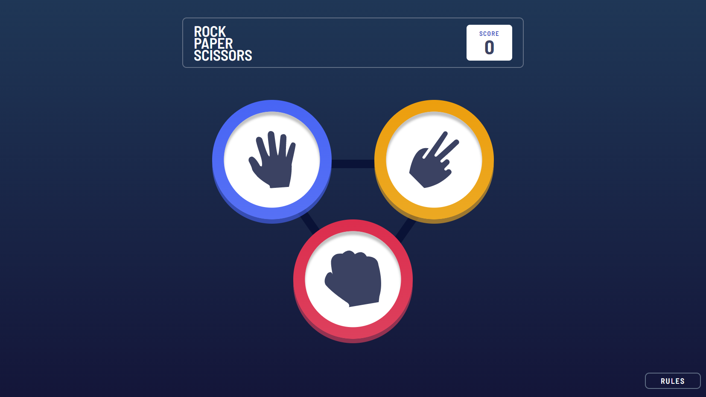
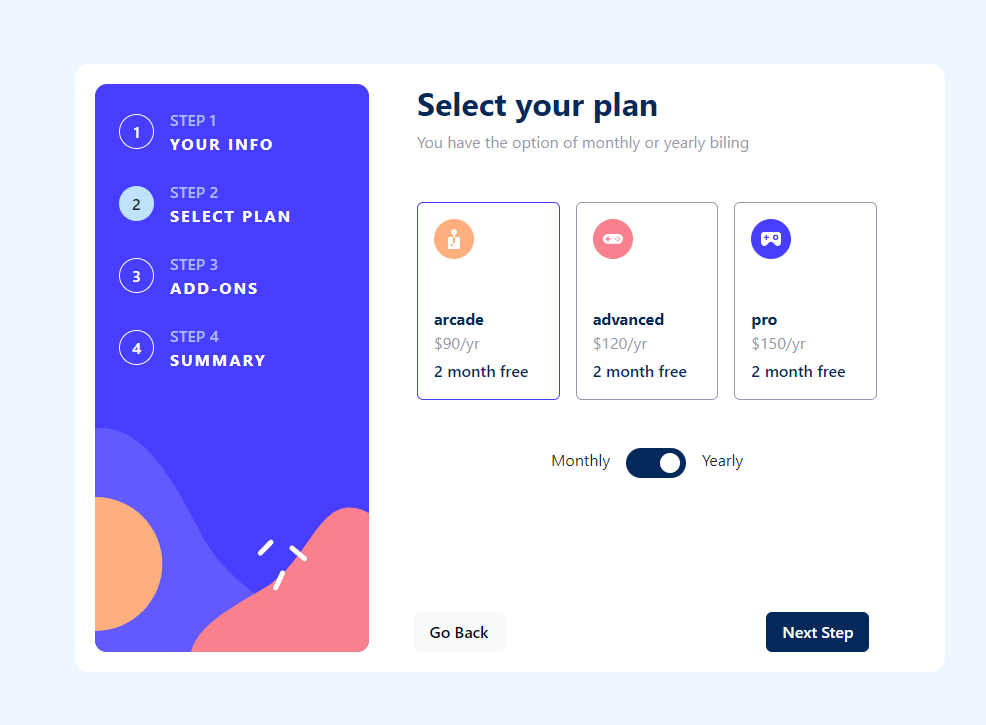
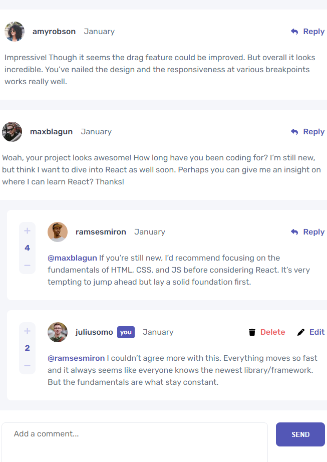
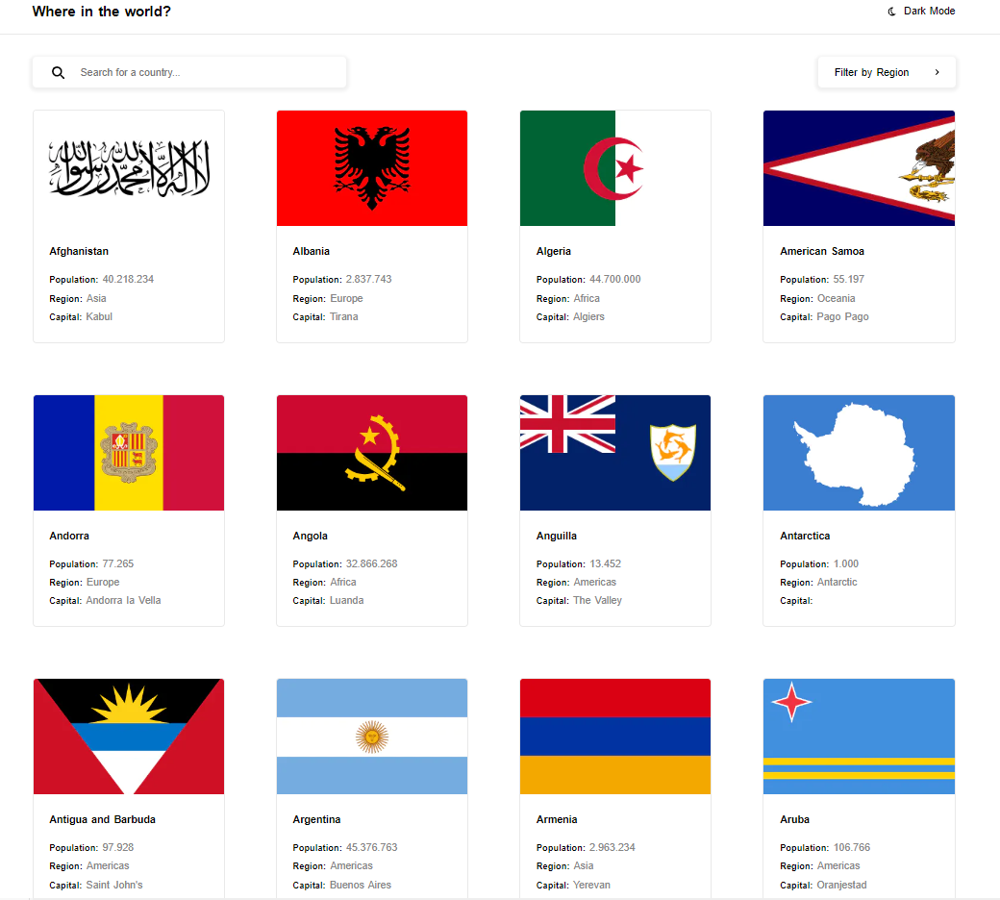
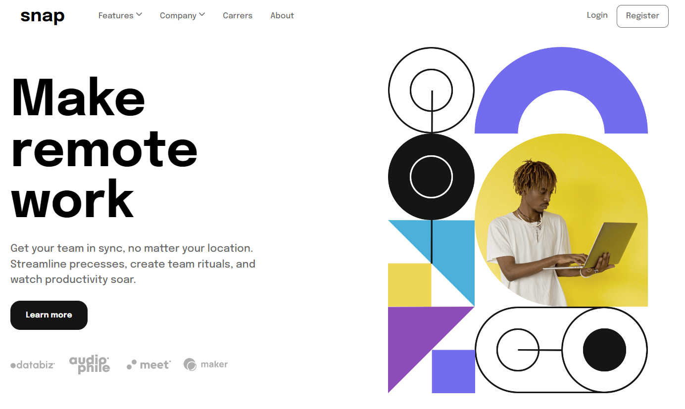
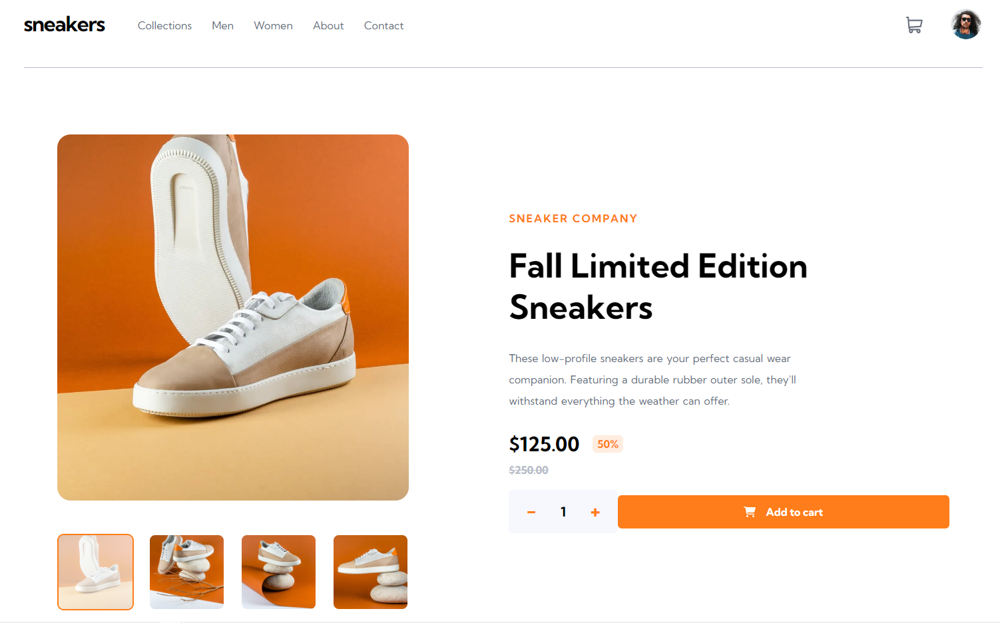
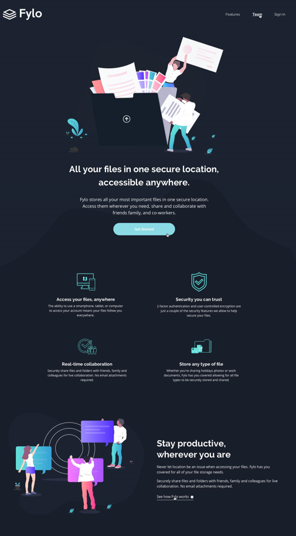

# Front Mentor - proyectos

Este repositorio sirve como un índice centralizado de los desafíos web de [Front Mentor](https://www.frontendmentor.io/), un sitio web que proporciona proyectos prácticos de desarrollo web para que los desarrolladores mejoren sus habilidades. En este repositorio, se encuentran los enlaces a otros repositorios que contienen los proyectos de los desafíos. Este catálogo permite a los usuarios encontrar fácilmente los desafíos disponibles y acceder a ellos de manera eficiente.

## Proyectos

 

### React / Next

 

    

        
        <a 
            style="cursor: pointer;"
            target="_blank"
            rel="noreferrer"
            href="https://rock-paper-scissors-frontmentor.vercel.app/"
        >Rock - Paper - Scissors</a>
    

    

        
        <a 
            style="cursor: pointer;"
            target="_blank"
            rel="noreferrer"
            href="https://multi-step-form-frontmentor.vercel.app/"
        >Multi Form</a>
    

 
 
 
 

    

        
        <a 
            style="cursor: pointer;"
            target="_blank"
            rel="noreferrer"
            href="https://front-mentor-comments-44826kw8x-leonardo-g.vercel.app/"
        >Comments</a>
    

    

        
        <a 
            style="cursor: pointer;"
            target="_blank"
            rel="noreferrer"
            href="https://front-end-contries.vercel.app/"
        >Countries</a>
    

 

    

        
        <a 
            style="cursor: pointer;"
            target="_blank"
            rel="noreferrer"
            href="https://intresection-frontmentor.vercel.app/"
        >IntroSection Page</a>
    

    

        
        <a 
            style="cursor: pointer;"
            target="_blank"
            rel="noreferrer"
            href="https://ecommerce-mentor-30tz3y3x3-leonardo-g.vercel.app/"
        >Ecommerce</a>
    

 
 
 

    

        
        <a 
            style="cursor: pointer;"
            target="_blank"
            rel="noreferrer"
            href="https://front-mentor-fylo-cdhdo5hf2-leonardo-g.vercel.app/"
        >Fylo Page</a>
    

